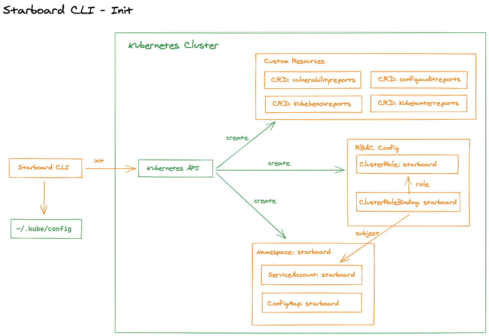

# Starboard Handbook

This handbook sets out to answer all your questions of why Starboard was implemented and how it is designed.

## Table of Contents

- [1 Manifesto](#1-manifesto)
- [2 Common Misconceptions](#2-common-misconceptions)
- [3 Frequently Asked Questions](#3-frequently-asked-questions)
- [4 Design](#4-design)
  - [Starboard CLI](#41-starboard-cli)

## 1 Manifesto

1. Starboard is a Kubernetes-native security toolkit. It's a set of principles and assumptions of how to run security
   scanners and associate the security reports with built-in Kubernetes resources rather than a particular
   implementation.
2. Starboard defines a set of custom resources (or custom security resources) but does not prescribe or enforce any
   naming conventions for such reports.
3. Custom security resources contain summary of risks and references to security databases. For example,
   a VulnerabilityReport contains summary of different severities and the link to AVD, but does not contain the detailed
   description of each vulnerability. Think of custom resources as pointers to data rather than self-contained values.
4. We assume that security reports are critical data for running secure Kubernetes cluster, therefore it is justified
   to store them in etcd by default.
5. We assume that security reports should be protected and are subject to Kubernetes RBAC permissions like any other
   built-in Kubernetes object.
6. Starboard does not store historical data, only the current state which represents security posture of your cluster.
7. Starboard CLI and Starboard Operator are reference implementations of the Starboard concepts. You can build your own
   tools or applications based on those concepts. If you are programming in Go, you can refer to the Starboard
   repository as Go module and reuse common functions used by Starboard CLI and Starboard Operator.

## 2 Common Misconceptions

### 2.1 Starboard is a deployable application

**Starboard** is a toolkit or a concept if you will. It's not a deployable application. You can run
**Starboard Operator** in your cluster, but you don't run Starboard in your cluster. Think of Starboard as we think
about **GitOps**. It's a way of doing things, but not a particular implementation like **FluxCD**.

## 3 Frequently Asked Questions

### 3.1 Why do you duplicate instances of VulnerabilityReports for the same image digest?

Docker image reference is not a first class citizen in Kubernetes. It's a property of the container definition.
Starboard relies on label selectors to associate VulnerabilityReports with corresponding Kubernetes workloads,
not particular image references. For example, we can get all reports for the `wordpress` Deployment with the following
command:

```
$ kubectl get vulnerabilityreports -l starboard.resource.kind=Deployment \
  -l starboard.resource.name=wordpress
```

Beyond that, for each instance of the VulnerabilityReports we set the owner reference pointing to the corresponding
pods controller. By doing that we can manage orphaned VulnerabilityReports and leverage Kubernetes garbage collection.
For example, if the `wordpress` Deployment is deleted, all related VulnerabilityReports are automatically garbage
collected.

### 3.2 Why do you create an instance of the VulnerabilityReport for each container?

The idea is to partition VulnerabilityReports generated for a particular Kubernetes workload by containers is to
mitigate the risk of exceeding the etcd request payload limit. By default, the payload of each Kubernetes object stored
etcd is subject to 1.5 MiB.

### 3.3 Is Starboard CLI required to run Starboard Operator or vice versa?

No. Starboard CLI and Starboard Operator are independent applications, even though they use compatible interfaces to
create or read security reports. For example, a VulnerabilityReports created by the Starboard Operator can be retrieved
with the Starboard CLI's `get` command.

## 4 Design

### 4.1 Starboard CLI

Starboard CLI is a stand-alone executable binary. You can run it as is or install as a kubectl plugin.
It's compatible with built-in kubectl commands. You configure Starboard CLI in the same way as kubectl is configure,
i.e. `~/.kube/config` file or `KUBECONFIG` environment variable.

### 4.1.1 Initialization

Starboard CLI requires one time initialization before it can run integrated scanners. The `init` command creates the
following Kubernetes objects, which are required to execute scan jobs and save output results as custom resources:

- Custom resources to store security reports
  - `vulnerabilityreports.aquasecurity.github.io`
  - `configadutireports.aquasecurity.github.io`
  - `ciskubebenchreports.aquasecurity.github.io`
  - `kubehunterreports.aquasecurity.github.io`
- The `starboard` namespace
  - The `starboard` ConfigMap with default settings to configure scanners
  - The `starboard` service account used by scan jobs to identify them as part of Starboard and to implement the least
    privileged principle
- Kubernetes RBAC config objects for the `starbaord` service account
  - The `starboard` ClusterRole
  - The `starboard` ClusterRoleBinding to bind the `starboard` service account with the `starboard` ClusterRole



### 4.1.2 Running scan jobs

### 4.2 Starboard Operator
